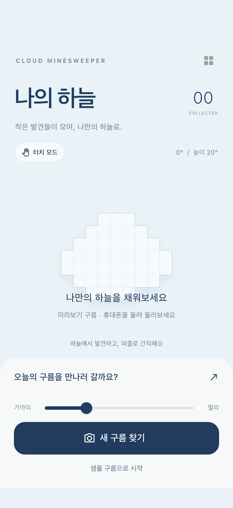
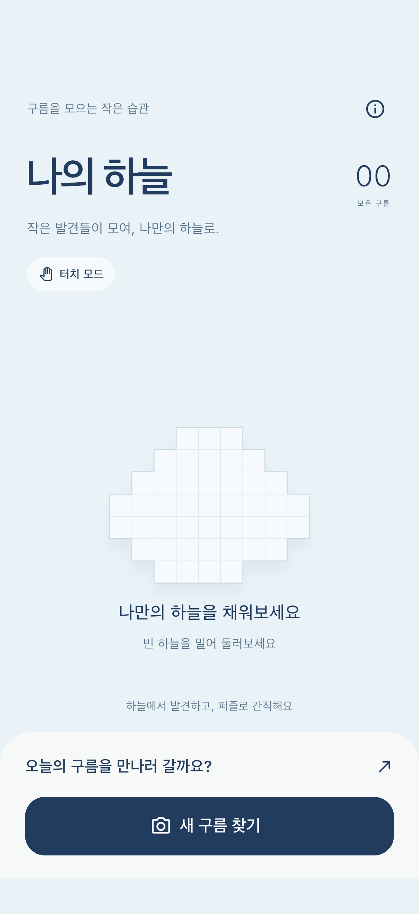
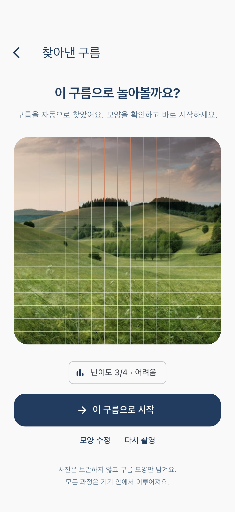
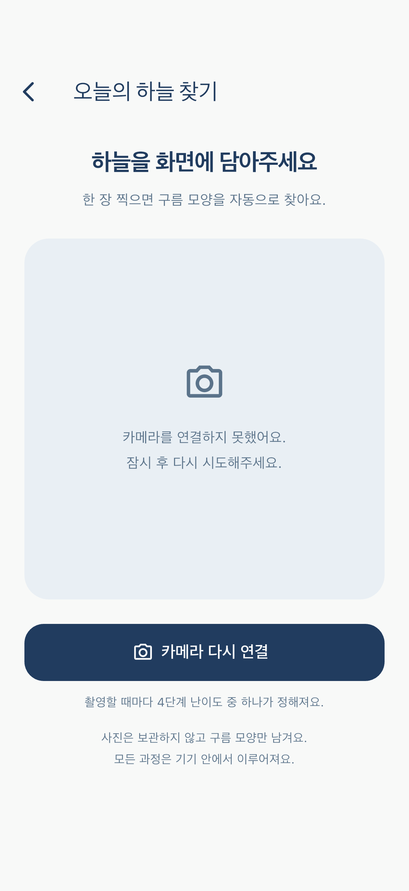
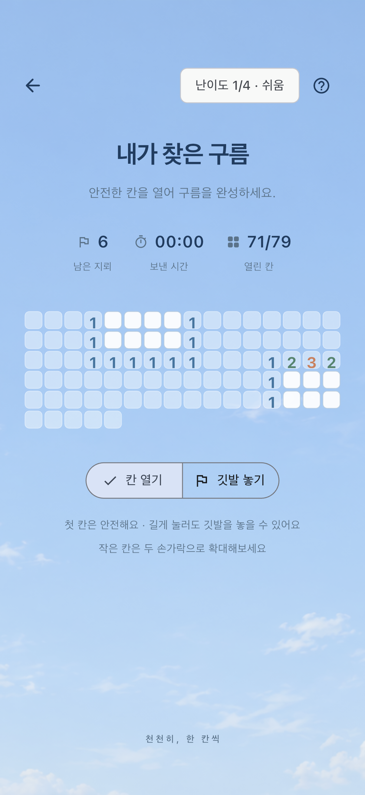
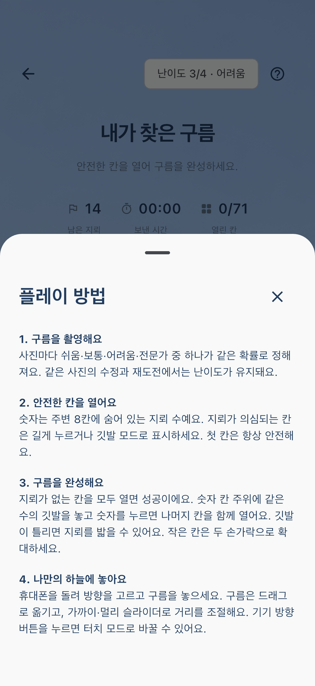
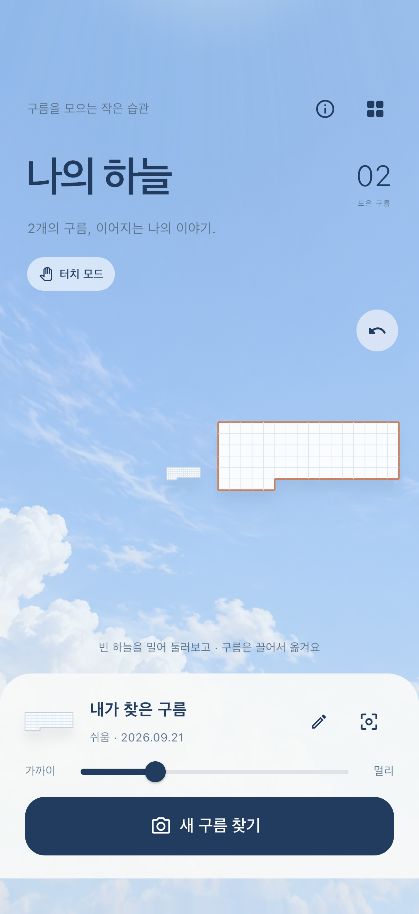
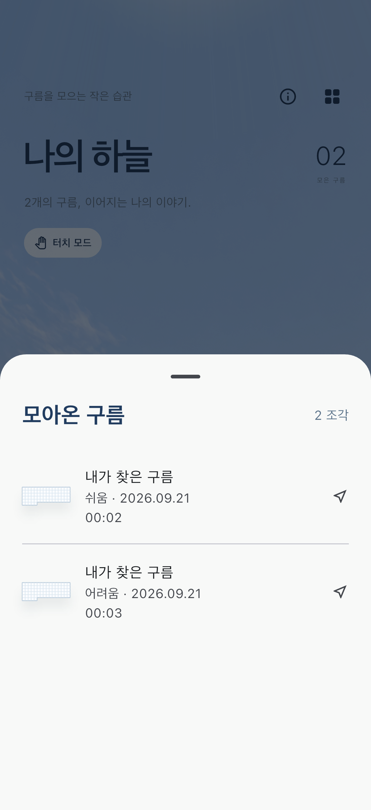
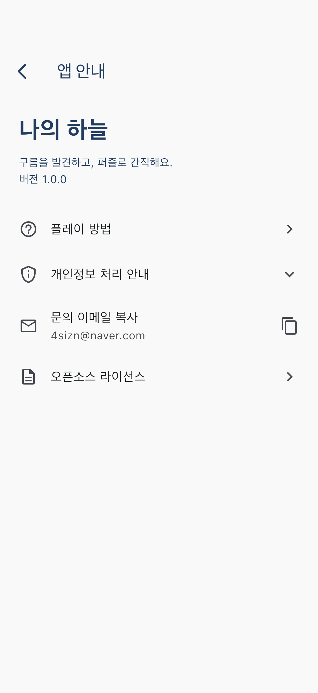

# 출시 화면 정리

2026-09-21. 현재 작업에서 iPhone 17 Pro 시뮬레이터의 실제 앱 흐름을 캡처하고 검토했다.
기존 디자인·하늘 배경·구름 배치를 유지하면서 촬영과 게임 진입을 정리했다.

## 1. 홈 — 정리 완료

기존 화면에서는 샘플 게임과 촬영이 경쟁하고, 수집 전에도 거리 슬라이더·비활성 도감·각도 숫자가 보였다.
샘플 버튼·선택 화면·각도 숫자를 제거했다. 거리 조절은 실제 조각을 선택했을 때만 표시한다.
첫 행동은 ‘새 구름 찾기’로 모으고, 기기 방향/터치 전환과 기존 구름 배치는 유지했다.

## 2. 촬영·모양 확인 — 정리 완료

카메라가 없을 때 샘플로 빠지는 흐름을 재연결 안내로 바꿨다.
권한이 거부되면 앱 설정 이동을 제공한다. 정상 판독 뒤에는 시작·모양 수정·다시 촬영만 노출한다.
편집을 펼쳤을 때만 선택 지우기·자동 선택 복원을 제공하며, 부족한 선택은 시작하지 못한다.
사진에 배정된 난이도는 시작 전에 표시하고 수정·재분석에서도 유지한다.

## 3. 게임 — 난이도·복구 추가

난이도 4단계는 실제 지뢰 비율이 다르며 사진마다 균등 무작위로 결정한다.
게임 상단에서 단계와 이름을 확인한다. 플레이 방법과 진행 중 이탈 확인을 추가했다.
작은 화면·글자 확대에서 상단 버튼을 유지하고, 통계와 조작 버튼은 필요한 만큼 줄을 바꾼다.
첫 칸 안전·핀치 확대·깃발 모드·다시 도전은 유지한다.

## 4. 수집·배치·도감 — 기존 기능 유지, 난이도 기록 추가

승리한 구름을 모아 방향을 고르고 거리 조절·배치·드래그·되돌리기·복원하는 흐름을 확인했다.
도감에 난이도를 함께 기록한다. 이전 버전의 도감은 보통 난이도와 기존 위치·거리로 유지한다.

## 5. 앱 안내 — 추가 완료

사용법·개인정보 처리 안내·문의 이메일 복사·오픈소스 라이선스를 한 화면에 모았다.
연락처는 사용자가 제공한 `4sizn@naver.com`을 사용한다. 도움말에는 명시적 닫기 버튼이 있다.

## 확인 범위

- 390×844 및 320×640 위젯 배치, 작은 화면에서 글씨 130% 확대 확인.
- 실제 iOS ONNX 런타임의 사진 판독과 게임·저장 흐름을 시뮬레이터에서 확인.
- 화면 캡처만으로 VoiceOver 전체 접근성이나 실기기 카메라 권한 복구를 완료했다고 보지 않는다.
- 자동 판독은 다양한 실기기 야외 사진을 더 평가해야 한다.
- 현재 모델 사용권한·운영자명·공개 개인정보/지원 URL은 [출시 점검](../release/README.md)의 남은 항목이다.
